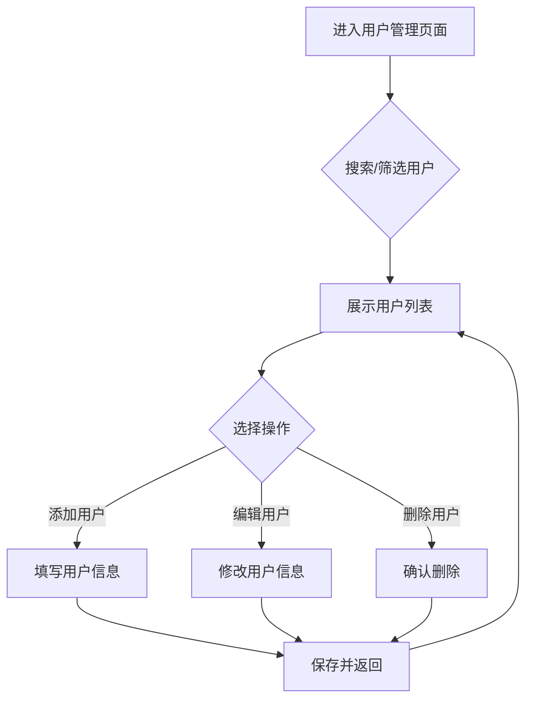
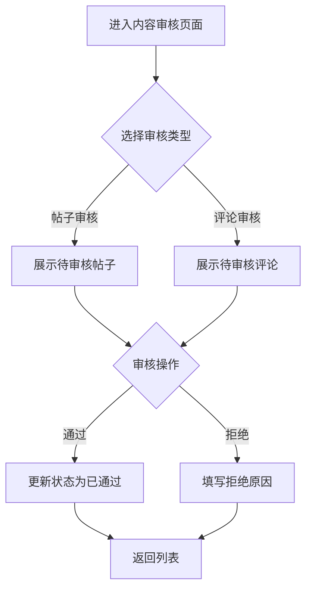
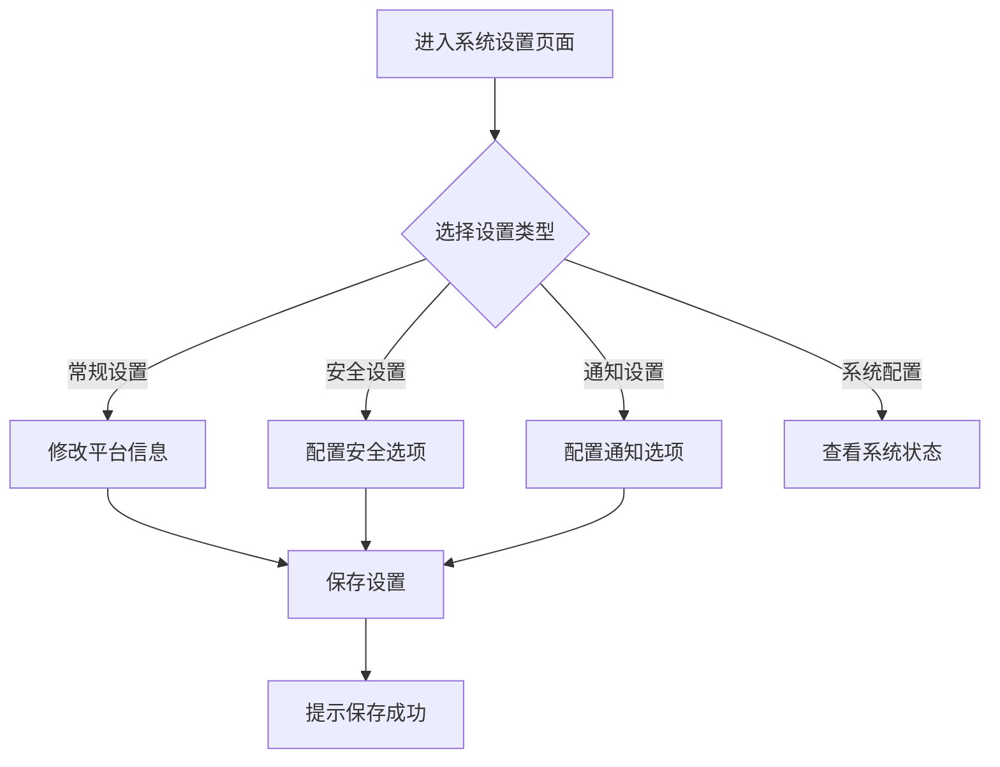

## 1. 产品概述
IT桌面运维互动平台管理员后台模块，为超级管理员提供全面的系统管理能力，包括用户管理、角色权限、内容审核、数据洞察和系统设置等核心功能。
- 解决平台统一管理需求，实现对所有版块的全量掌控
- 目标用户：平台超级管理员，实现高效的系统运维管理

## 2. 核心功能

### 2.1 用户角色
| 角色 | 权限说明 |
|------|----------|
| 超级管理员 | 拥有所有权限，可管理用户、角色、内容、系统设置等 |

### 2.2 功能模块
1. **仪表台**：系统概览、数据统计、实时状态监控
2. **用户管理**：用户列表、增删改查、状态管理、角色分配
3. **角色权限**：角色定义、权限配置、权限继承
4. **内容审核**：帖子审核、文档管理、评论管理
5. **数据洞察**：数据分析、图表展示、趋势分析
6. **系统设置**：常规设置、安全设置、通知设置、系统配置

### 2.3 页面详情
| 页面名称 | 模块名称 | 功能描述 |
|----------|----------|----------|
| 仪表台 | 数据统计卡片 | 展示用户数、帖子数、文档数、工单数等核心指标 |
| 仪表台 | 实时状态监控 | 服务器状态、数据库状态、API状态实时展示 |
| 仪表台 | 最新动态 | 最新用户注册、最新帖子、待审核内容 |
| 用户管理 | 用户列表 | 支持搜索、筛选、分页的用户数据展示 |
| 用户管理 | 用户操作 | 用户创建、编辑、删除、角色变更 |
| 角色权限 | 角色列表 | 角色展示、权限可视化 |
| 角色权限 | 权限配置 | 自定义权限、批量授权 |
| 内容审核 | 帖子审核 | 待审核帖子列表、通过/拒绝操作 |
| 内容审核 | 文档管理 | 文档上传、编辑、删除、版本管理 |
| 内容审核 | 评论管理 | 评论列表、审核、删除 |
| 数据洞察 | 数据图表 | 用户增长、活跃度、内容统计图表 |
| 数据洞察 | 趋势分析 | 多维度数据分析和趋势预测 |
| 系统设置 | 常规设置 | 平台名称、描述、语言、时区配置 |
| 系统设置 | 安全设置 | 双因素认证、会话超时、登录尝试限制 |
| 系统设置 | 通知设置 | 邮件通知、推送通知配置 |
| 系统设置 | 系统配置 | API配置、服务器信息展示 |

## 3. 核心流程

### 3.1 用户管理流程

### 3.2 内容审核流程

### 3.3 系统设置流程

## 4. 用户界面设计

### 4.1 设计风格
- **主色调**：深蓝色系（#1e40af）作为主色，配合灰色系作为辅助色
- **按钮风格**：圆角矩形，悬停时有颜色渐变效果
- **字体**：中文字体使用微软雅黑/思源黑体，英文使用Inter
- **布局风格**：左侧侧边栏导航 + 右侧主内容区的经典后台布局
- **图标风格**：使用Lucide图标库，统一风格

### 4.2 页面设计概述
| 页面名称 | 模块名称 | UI元素 |
|----------|----------|--------|
| 仪表台 | 统计卡片 | 卡片式布局、数值展示、趋势箭头、图标 |
| 仪表台 | 状态监控 | 状态指示灯、资源使用率、响应时间 |
| 用户管理 | 用户列表 | 表格展示、搜索框、筛选下拉框、操作按钮组 |
| 用户管理 | 弹窗表单 | 模态框、表单输入、验证提示、操作按钮 |
| 角色权限 | 角色卡片 | 卡片网格、权限标签、编辑删除按钮 |
| 内容审核 | 审核列表 | 列表展示、状态标签、审核操作按钮 |
| 数据洞察 | 图表区域 | 多种图表类型、时间范围选择器 |
| 系统设置 | 设置面板 | 标签页切换、表单输入、开关组件 |

### 4.3 响应性
- **桌面优先**：针对1280px以上屏幕优化
- **平板适配**：侧边栏可折叠，布局自适应
- **移动端**：简化布局，使用抽屉式导航

### 4.4 交互设计
- 所有可点击元素有悬停状态反馈
- 表单提交有加载状态和成功/失败提示
- 删除操作需要二次确认
- 数据加载时显示骨架屏或加载动画