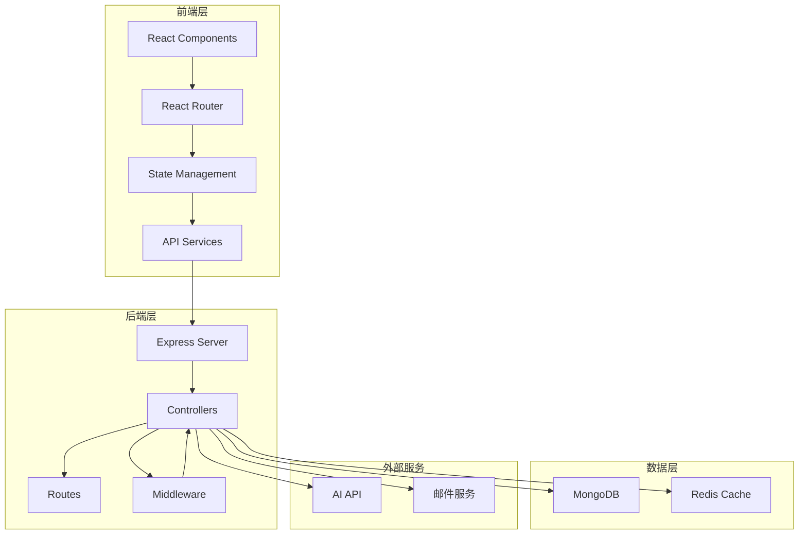
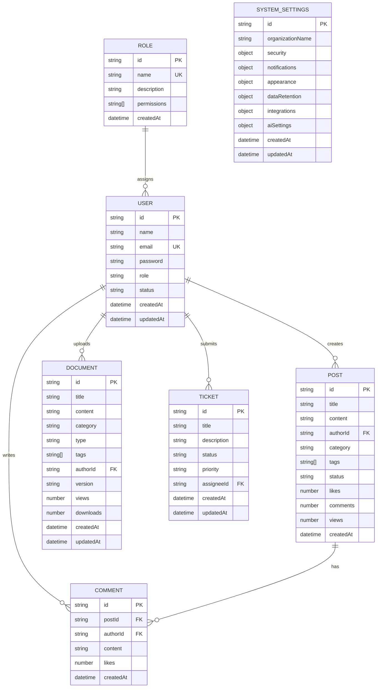

## 1. 架构设计



## 2. 技术说明
- **前端**：React@18 + TypeScript + TailwindCSS@3 + Vite
- **路由**：react-router-dom@6
- **状态管理**：Zustand
- **图标**：Lucide React
- **图表**：Recharts
- **后端**：Express@4 + Node.js
- **数据库**：MongoDB（使用Mock数据）
- **初始化工具**：Vite

## 3. 路由定义

| 路由 | 页面组件 | 功能描述 |
|------|----------|----------|
| `/` | Dashboard | 仪表台首页 |
| `/users` | UserManagement | 用户管理页面 |
| `/roles` | RoleManagement | 角色权限管理页面 |
| `/review` | ReviewManagement | 内容审核页面 |
| `/analytics` | Analytics | 数据洞察页面 |
| `/settings` | Settings | 系统设置页面 |
| `/login` | Login | 登录页面 |

## 4. API 定义

### 4.1 用户管理 API

#### GET /api/users
**请求**：无
**响应**：
```typescript
{
  users: User[];
  total: number;
  page: number;
  limit: number;
}
```

#### POST /api/users
**请求**：
```typescript
{
  name: string;
  email: string;
  password: string;
  role: string;
}
```
**响应**：
```typescript
{
  success: boolean;
  user: User;
}
```

#### PUT /api/users/:id
**请求**：
```typescript
{
  name?: string;
  email?: string;
  role?: string;
  status?: string;
}
```
**响应**：
```typescript
{
  success: boolean;
  user: User;
}
```

#### DELETE /api/users/:id
**请求**：无
**响应**：
```typescript
{
  success: boolean;
  message: string;
}
```

### 4.2 角色权限 API

#### GET /api/roles
**请求**：无
**响应**：
```typescript
{
  roles: Role[];
}
```

#### POST /api/roles
**请求**：
```typescript
{
  name: string;
  description: string;
  permissions: string[];
}
```
**响应**：
```typescript
{
  success: boolean;
  role: Role;
}
```

#### PUT /api/roles/:id
**请求**：
```typescript
{
  name?: string;
  description?: string;
  permissions?: string[];
}
```
**响应**：
```typescript
{
  success: boolean;
  role: Role;
}
```

#### DELETE /api/roles/:id
**请求**：无
**响应**：
```typescript
{
  success: boolean;
  message: string;
}
```

### 4.3 内容审核 API

#### GET /api/review/posts
**请求**：`?status=pending|approved|rejected`
**响应**：
```typescript
{
  posts: Post[];
}
```

#### PUT /api/review/posts/:id/approve
**请求**：无
**响应**：
```typescript
{
  success: boolean;
  post: Post;
}
```

#### PUT /api/review/posts/:id/reject
**请求**：
```typescript
{
  reason: string;
}
```
**响应**：
```typescript
{
  success: boolean;
  post: Post;
}
```

#### DELETE /api/review/posts/:id
**请求**：无
**响应**：
```typescript
{
  success: boolean;
  message: string;
}
```

### 4.4 文档管理 API

#### GET /api/documents
**请求**：无
**响应**：
```typescript
{
  documents: Document[];
}
```

#### POST /api/documents
**请求**：
```typescript
{
  title: string;
  content: string;
  category: string;
  tags: string[];
}
```
**响应**：
```typescript
{
  success: boolean;
  document: Document;
}
```

#### DELETE /api/documents/:id
**请求**：无
**响应**：
```typescript
{
  success: boolean;
  message: string;
}
```

### 4.5 系统设置 API

#### GET /api/settings
**请求**：无
**响应**：
```typescript
{
  settings: SystemSettings;
}
```

#### PUT /api/settings
**请求**：
```typescript
{
  siteName?: string;
  siteDescription?: string;
  defaultLanguage?: string;
  timezone?: string;
}
```
**响应**：
```typescript
{
  success: boolean;
  settings: SystemSettings;
}
```

#### PUT /api/settings/security
**请求**：
```typescript
{
  enableTwoFactor?: boolean;
  sessionTimeout?: number;
  maxLoginAttempts?: number;
}
```
**响应**：
```typescript
{
  success: boolean;
  settings: SystemSettings;
}
```

### 4.6 数据洞察 API

#### GET /api/analytics
**请求**：无
**响应**：
```typescript
{
  totalUsers: number;
  activeUsers: number;
  totalPosts: number;
  totalDocuments: number;
  totalTickets: number;
  pendingTickets: number;
  resolvedTickets: number;
  averageResponseTime: number;
  userGrowth: { date: string; count: number }[];
  postActivity: { date: string; count: number }[];
}
```

## 5. 数据模型

### 5.1 数据模型定义



### 5.2 类型定义

```typescript
interface User {
  id: string;
  name: string;
  email: string;
  role: 'admin' | 'user';
  status: 'online' | 'offline';
  createdAt: string;
  updatedAt?: string;
}

interface Role {
  id: string;
  name: string;
  description: string;
  permissions: string[];
  createdAt: string;
}

interface Post {
  id: string;
  title: string;
  content: string;
  author: string;
  authorId: string;
  category: string;
  tags: string[];
  status: 'pending' | 'approved' | 'rejected';
  likes: number;
  comments: number;
  views: number;
  createdAt: string;
}

interface Document {
  id: string;
  title: string;
  content: string;
  category: string;
  type: string;
  tags: string[];
  author: string;
  authorId: string;
  version: string;
  views: number;
  downloads: number;
  createdAt: string;
  updatedAt: string;
}

interface Comment {
  id: string;
  postId: string;
  author: string;
  authorId: string;
  content: string;
  likes: number;
  createdAt: string;
}

interface Ticket {
  id: string;
  title: string;
  description: string;
  status: 'pending' | 'processing' | 'resolved';
  priority: 'low' | 'medium' | 'high';
  assignee?: string;
  createdAt: string;
  updatedAt: string;
}

interface SystemSettings {
  id: string;
  organizationName: string;
  siteName: string;
  siteDescription: string;
  defaultLanguage: string;
  timezone: string;
  security: {
    enableTwoFactor: boolean;
    sessionTimeout: number;
    maxLoginAttempts: number;
  };
  notifications: {
    enableNotifications: boolean;
    enableEmailNotifications: boolean;
    enablePushNotifications: boolean;
  };
  createdAt: string;
  updatedAt: string;
}

interface AnalyticsData {
  totalUsers: number;
  activeUsers: number;
  totalPosts: number;
  totalDocuments: number;
  totalTickets: number;
  pendingTickets: number;
  resolvedTickets: number;
  averageResponseTime: number;
  userGrowth: { date: string; count: number }[];
  postActivity: { date: string; count: number }[];
  documentStats: { category: string; count: number }[];
  ticketStats: { status: string; count: number }[];
}
```

## 6. 项目结构

```
admin-frontend/
├── src/
│   ├── components/          # 通用组件
│   │   ├── Header.tsx
│   │   ├── Sidebar.tsx
│   │   ├── StatCard.tsx
│   │   ├── Modal.tsx
│   │   └── Table.tsx
│   ├── contexts/            # 状态上下文
│   │   └── AuthContext.tsx
│   ├── hooks/               # 自定义hooks
│   │   └── useAuth.ts
│   ├── pages/               # 页面组件
│   │   ├── Dashboard.tsx
│   │   ├── UserManagement.tsx
│   │   ├── RoleManagement.tsx
│   │   ├── ReviewManagement.tsx
│   │   ├── Analytics.tsx
│   │   ├── Settings.tsx
│   │   └── Login.tsx
│   ├── services/            # API服务
│   │   └── api.ts
│   ├── types/               # 类型定义
│   │   └── index.ts
│   ├── App.tsx              # 主应用组件
│   ├── main.tsx             # 入口文件
│   └── index.css            # 全局样式
├── public/                  # 静态资源
├── index.html               # HTML模板
├── package.json             # 依赖配置
├── vite.config.ts           # Vite配置
├── tailwind.config.js       # Tailwind配置
├── postcss.config.js        # PostCSS配置
└── tsconfig.json            # TypeScript配置
```

## 7. 安全考虑

1. **身份认证**：JWT Token认证，存储在localStorage
2. **权限控制**：基于角色的访问控制（RBAC）
3. **输入验证**：前端表单验证 + 后端参数校验
4. **数据加密**：密码使用bcrypt加密存储
5. **HTTPS**：生产环境强制HTTPS
6. **会话管理**：支持会话超时和手动退出
7. **SQL注入防护**：使用参数化查询
8. **XSS防护**：React自动转义 + 内容过滤