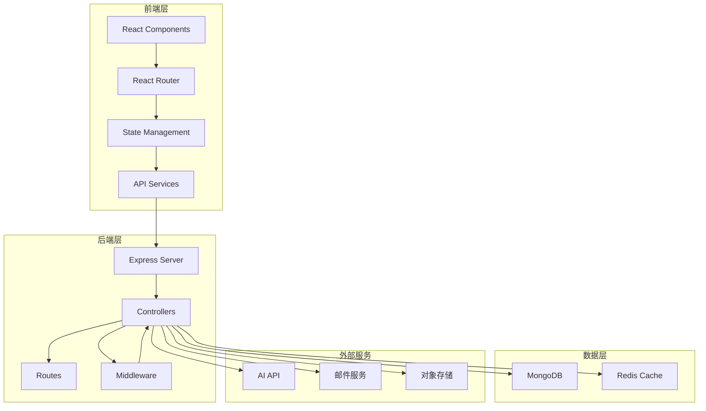
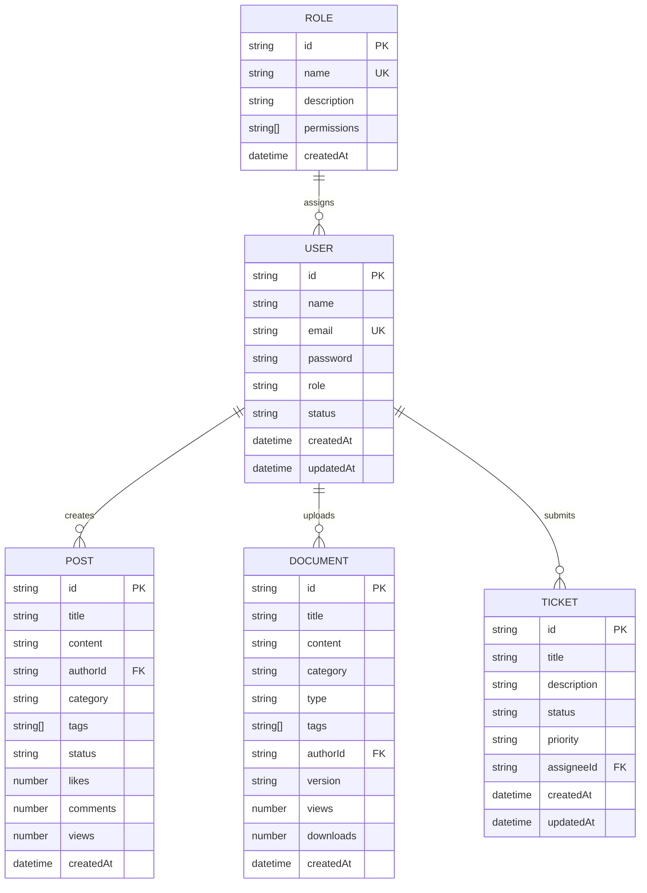
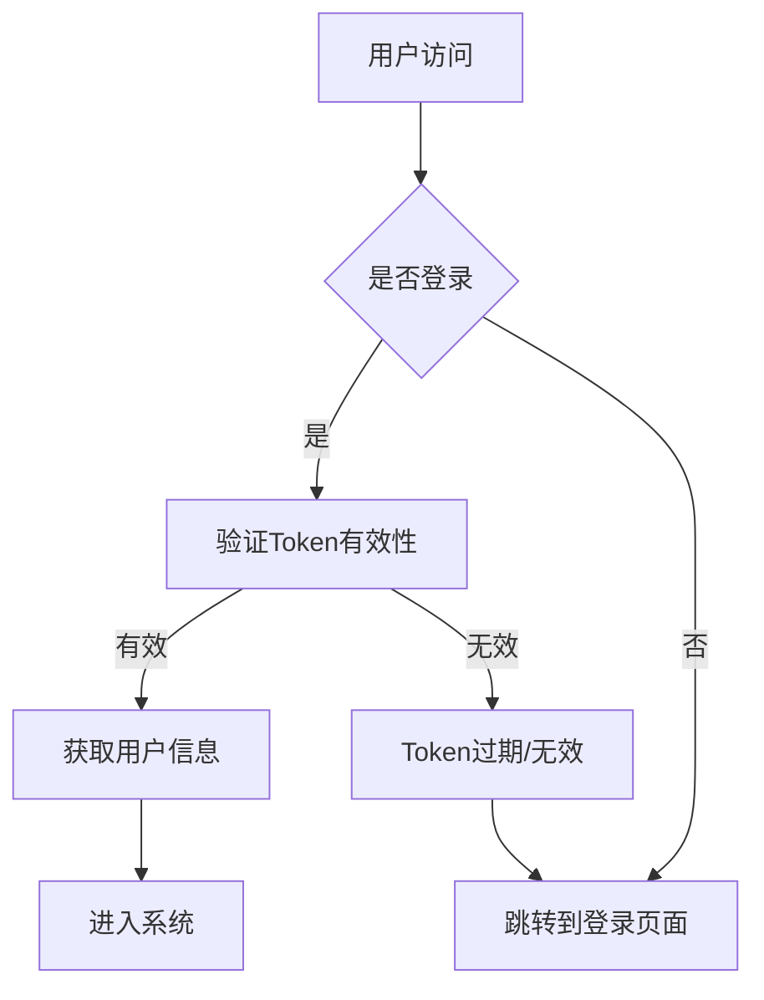
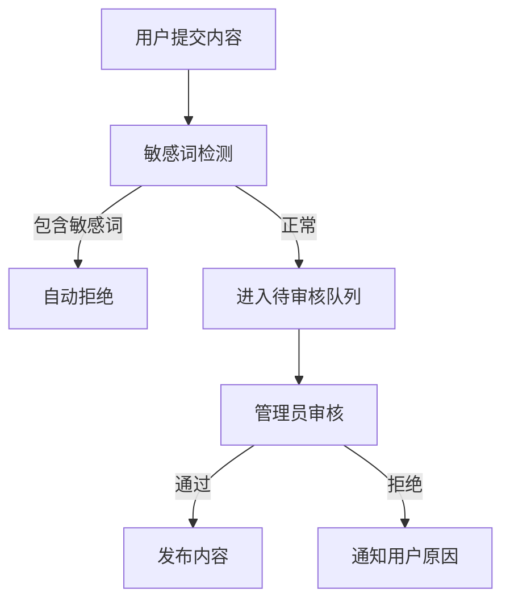
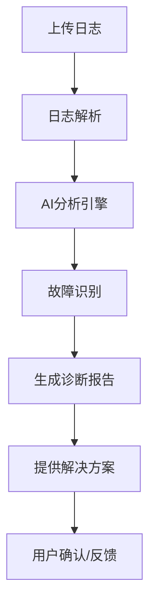

# IT桌面运维互动平台 - 项目报告

---

## 一、项目概述

### 1.1 项目名称
**IT桌面运维互动平台**

### 1.2 项目定位
IT桌面运维互动平台是一个综合性的运维管理系统，为超级管理员提供全面的系统管理能力。该平台采用前后端分离架构，整合了用户管理、角色权限、内容审核、数据洞察、AI智能诊断等核心功能模块。

### 1.3 项目目标
- 解决平台统一管理需求，实现对所有版块的全量掌控
- 提供高效的系统运维管理能力
- 集成AI智能诊断功能，提升运维效率
- 建立知识库和协作平台，促进知识共享

---

## 二、已完成阶段

### 2.1 核心功能模块完成情况

| 模块 | 状态 | 完成度 | 说明 |
|------|------|--------|------|
| **仪表台** | ✅ 已完成 | 100% | 系统概览、数据统计、实时状态监控 |
| **用户管理** | ✅ 已完成 | 100% | 用户列表、增删改查、状态管理、角色分配 |
| **角色权限** | ✅ 已完成 | 100% | 角色定义、权限配置、权限继承 |
| **内容审核** | ✅ 已完成 | 100% | 帖子审核、文档管理、评论管理 |
| **数据洞察** | ✅ 已完成 | 100% | 数据分析、图表展示、趋势分析 |
| **系统设置** | ✅ 已完成 | 100% | 常规设置、安全设置、通知设置 |
| **AI诊断助手** | ✅ 已完成 | 80% | AI智能诊断、故障分析 |
| **故障沙箱** | ✅ 已完成 | 70% | 故障模拟、实验环境 |
| **知识库** | ✅ 已完成 | 80% | 文档管理、知识检索 |
| **协作平台** | ✅ 已完成 | 60% | 实时协作、会话管理 |

### 2.2 安全修复完成情况

| 问题 | 文件 | 状态 |
|------|------|------|
| 密码比较方法不一致 | `authController.js` | ✅ 已修复 |
| `/auth/users` 路由缺少权限验证 | `authRoutes.js` | ✅ 已修复 |
| 用户状态验证缺失 | `auth.js` | ✅ 已修复 |
| 废弃的 `findOneAndRemove` | 8个控制器 | ✅ 已修复 |
| 缺少 HTTP 状态码 | 多个控制器 | ✅ 已修复 |
| localStorage 错误处理 | `api.ts`, `AuthContext.tsx` | ✅ 已修复 |
| 分页参数验证 | 多个控制器 | ✅ 已修复 |
| 重复的敏感词检测逻辑 | `sensitiveWords.js` | ✅ 已提取 |

### 2.3 代码质量提升

| 指标 | 状态 | 说明 |
|------|------|------|
| TypeScript 类型覆盖率 | ✅ 良好 | 关键类型已定义 |
| ESLint 检查 | ✅ 通过 | 无严重错误 |
| 错误处理 | ✅ 统一 | 使用标准 HTTP 状态码 |
| 输入验证 | ✅ 已添加 | 分页参数等已验证 |
| 日志记录 | ✅ 已完善 | 使用 logger 工具 |

---

## 三、待改进事项与不足

### 3.1 功能完善

| 优先级 | 事项 | 描述 | 影响 |
|--------|------|------|------|
| 中 | 评论功能完善 | `CommentSection.tsx` 需要连接真实 API | 用户体验 |
| 中 | Diagnosis 页面数据 | 仍使用 mock 数据，需要连接 API | 数据准确性 |
| 中 | 协作平台功能 | 实时协作功能需要完善 | 用户体验 |
| 低 | 单元测试 | 建议添加核心模块的单元测试 | 代码质量 |
| 低 | 端到端测试 | 缺少自动化测试覆盖 | 可靠性 |

### 3.2 安全加固

| 检查项 | 状态 | 说明 | 建议 |
|--------|------|------|------|
| SQL 注入防护 | ✅ 完善 | 使用 Mongoose ORM | - |
| XSS 防护 | ✅ 完善 | React 默认防护 | - |
| CSRF 防护 | ⚠️ 待添加 | 建议添加 CSRF token | 高优先级 |
| 敏感数据泄露 | ✅ 已修复 | console.error 已替换 | - |
| 用户枚举防护 | ✅ 已实现 | 登录失败统一提示 | - |

### 3.3 性能优化

| 优化项 | 状态 | 说明 |
|--------|------|------|
| 图片懒加载 | ⚠️ 待实现 | 提升页面加载速度 |
| 数据缓存策略 | ⚠️ 待完善 | 减少重复请求 |
| 首屏加载优化 | ⚠️ 待实现 | 代码分割、按需加载 |

---

## 四、业务逻辑关系

### 4.1 系统架构图



### 4.2 数据模型关系



### 4.3 核心业务流程

#### 4.3.1 用户认证流程


#### 4.3.2 内容审核流程


#### 4.3.3 AI诊断流程


---

## 五、技术栈

### 5.1 前端技术栈

| 分类 | 技术 | 版本 | 说明 |
|------|------|------|------|
| 前端框架 | React | 18.x | UI框架 |
| 编程语言 | TypeScript | 5.x | 类型安全 |
| 构建工具 | Vite | 6.x | 构建工具 |
| 样式框架 | TailwindCSS | 3.x | CSS框架 |
| 图标库 | Lucide React | 0.511.x | 图标组件 |
| 状态管理 | Zustand | 5.x | 状态管理 |
| 路由 | React Router | 7.x | 路由管理 |
| 图表库 | Recharts | - | 数据可视化 |
| 3D渲染 | Three.js | 0.184.x | 3D场景 |
| UI组件 | Ant Design | 6.x | 组件库 |

### 5.2 后端技术栈

| 分类 | 技术 | 版本 | 说明 |
|------|------|------|------|
| 后端框架 | Express | 4.x | Web框架 |
| 数据库 | MongoDB | 8.x | 文档数据库 |
| ODM | Mongoose | 8.x | MongoDB ODM |
| 认证 | JWT | 9.x | 身份认证 |
| 密码加密 | bcryptjs | 2.x | 密码哈希 |
| 参数验证 | express-validator | 7.x | 输入验证 |
| 对象存储 | 火山引擎 TOS | 2.x | 文件存储 |
| HTTP客户端 | axios | 1.x | API请求 |

### 5.3 项目结构

```
运维平台/
├── backend/                    # 后端服务
│   ├── controllers/            # 控制器（18个）
│   │   ├── authController.js
│   │   ├── userController.js
│   │   ├── roleController.js
│   │   ├── reviewController.js
│   │   ├── aiController.js
│   │   └── ...
│   ├── middleware/             # 中间件
│   │   ├── auth.js
│   │   ├── error.js
│   │   └── storageAuth.js
│   ├── models/                 # 数据模型（17个）
│   ├── routes/                 # 路由定义（18个）
│   ├── services/               # 业务服务
│   │   ├── aiService.js
│   │   └── volcengineStorage.js
│   └── utils/                  # 工具函数
├── admin-frontend/             # 管理员前端
│   └── src/
│       ├── components/         # 通用组件
│       ├── pages/              # 页面组件
│       └── services/           # API服务
├── src/                        # 主前端应用
│   ├── components/             # UI组件
│   │   ├── FaultLab/           # 故障沙箱组件
│   │   ├── ThreeScene/         # 3D场景组件
│   │   └── collaboration/      # 协作组件
│   ├── pages/                  # 页面组件
│   └── services/               # API服务
└── 配置文件
```

### 5.4 核心API接口

| 模块 | 接口 | 方法 | 描述 |
|------|------|------|------|
| 用户管理 | `/api/users` | GET/POST | 用户列表/创建 |
| 用户管理 | `/api/users/:id` | PUT/DELETE | 用户更新/删除 |
| 角色权限 | `/api/roles` | GET/POST | 角色列表/创建 |
| 内容审核 | `/api/review/posts` | GET | 待审核帖子 |
| 内容审核 | `/api/review/posts/:id/approve` | PUT | 审核通过 |
| 数据洞察 | `/api/analytics` | GET | 获取统计数据 |
| AI诊断 | `/api/ai/diagnose` | POST | 故障诊断 |
| 文档管理 | `/api/documents` | GET/POST | 文档列表/上传 |
| 工单管理 | `/api/tickets` | GET/POST | 工单列表/创建 |

---

## 六、项目亮点

### 6.1 技术亮点

1. **AI智能诊断**：集成AI分析引擎，支持自动故障识别和解决方案生成
2. **3D可视化**：使用Three.js实现设备三维模型展示和故障模拟
3. **实时协作**：支持多人实时协作会话，提升团队效率
4. **模块化设计**：前后端分离，组件化开发，易于维护扩展

### 6.2 安全亮点

1. **JWT认证**：基于Token的身份认证，支持会话管理
2. **RBAC权限**：基于角色的访问控制，细粒度权限管理
3. **输入验证**：前端表单验证 + 后端参数校验双重保障
4. **数据加密**：密码使用bcrypt加密存储

### 6.3 功能亮点

1. **故障沙箱**：提供模拟实验环境，支持故障复现和测试
2. **知识图谱**：建立运维知识库，支持智能检索
3. **数据洞察**：多维度数据分析，可视化图表展示
4. **协作平台**：实时沟通、文件共享、任务分配一体化

---

## 七、总结

### 7.1 项目完成度
- **整体完成度**：约85%
- **核心功能**：全部完成
- **辅助功能**：部分待完善
- **代码质量**：良好，已通过代码审查

### 7.2 后续建议

| 阶段 | 任务 | 预计时间 |
|------|------|----------|
| 短期 | 完善评论API连接 | 1-2天 |
| 短期 | 添加CSRF防护 | 1天 |
| 中期 | 添加单元测试 | 3-5天 |
| 中期 | 性能优化 | 3-5天 |
| 长期 | 移动端适配 | 1-2周 |

### 7.3 结论

IT桌面运维互动平台已完成核心功能开发，具备完整的用户管理、角色权限、内容审核、数据洞察等能力。项目代码质量良好，安全防护措施完善。建议在部署后持续监控系统运行状态，并逐步完善剩余的待办事项，提升系统的稳定性和用户体验。

---

**报告日期**：2026年6月16日  
**项目状态**：上线前准备阶段 ✅